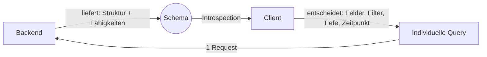
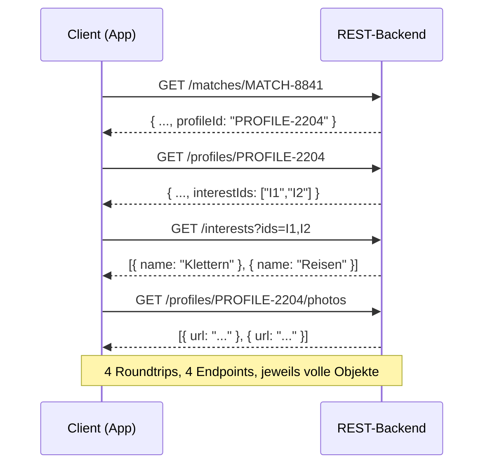
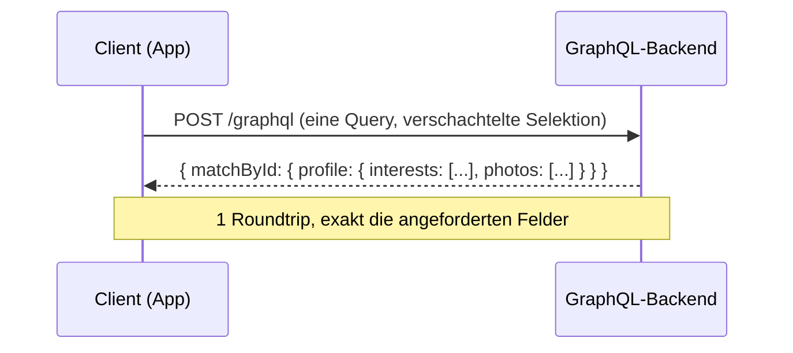
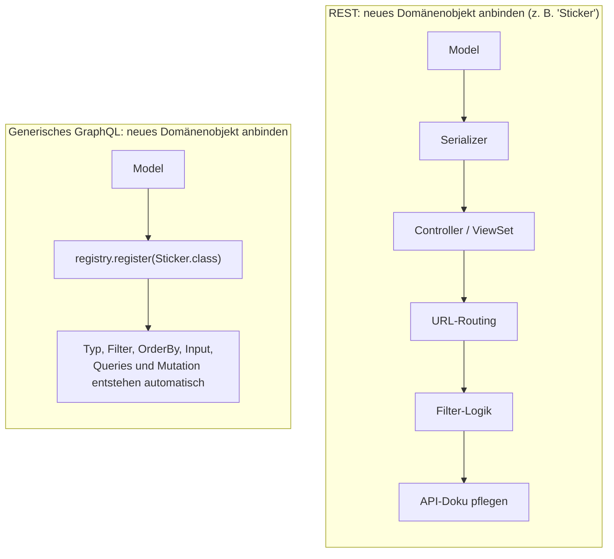

# Warum ein generisches GraphQL-Schema? – Der Blick aus Client-Sicht

*Beispieldomäne: eine Dating-Applikation (Profile, Matches, Interessen,
Chats) – zur Veranschaulichung des Prinzips für ein Dating-App-Dev-Team.*

## Kernaussage

> Das Backend baut einmal eine **Datenstruktur + einen Fähigkeiten-Katalog**
> auf. Ab dann entscheidet der **Client**, welche Daten er wie kombiniert,
> filtert, sortiert und historisch abfragt – ohne dass dafür je wieder
> Backend-Code geschrieben werden muss.



Das Backend wird vom "Endpoint-Lieferanten" zur **Datenquelle mit
Fähigkeiten**. Die fachliche Entscheidung – *welche* Daten in *welcher
Kombination* für *welchen Screen/Feature* gebraucht werden – wandert dahin,
wo sie auch entsteht: zum Client (App-Team, Web-Team, Data-Science-Team, ...).

---

## Derselbe Anwendungsfall: REST vs. generisches GraphQL

Anwendungsfall: "Zeig mir zu einem Match das Profil der/des anderen
Nutzer:in, deren Interessen und die Fotos."

### REST (klassisch) – ein Aufruf pro Beziehung



Jede neue Relation in der Kette = ein weiterer Roundtrip. Jeder Endpoint
liefert außerdem sein volles, fest definiertes Response-Objekt – auch
Felder, die der Client für diesen Screen gar nicht braucht (z. B. interne
Scoring-Werte im Match-Objekt, die nur der Empfehlungsalgorithmus nutzt).

### Generisches GraphQL – ein Request, Client bestimmt Tiefe und Felder



```graphql
query {
  matchById(id: "MATCH-8841") {
    matchedAt
    profile {
      displayName
      bio
      interests { name }
      photos { url }
    }
  }
}
```

Für den "Match-Karten"-Screen in der App reicht dieser eine Request. Für
den Detail-Screen fragt derselbe Client einfach mehr Felder ab (z. B.
`lastActiveAt`, `verifiedAt`) – ohne dass sich am Backend etwas ändert.
Intern batcht das Backend diese Relationsauflösung per Dataloader (kein
N+1-Problem) – für den Client ist das unsichtbar, er sieht nur: ein
Request, eine passgenaue Antwort.

---

## Vergleichstabelle

| Dimension | REST (klassisch) | Generisches GraphQL |
|---|---|---|
| Endpoints | 1 Endpoint pro Ressource, oft plus Sonderparameter (`?include=`, `?expand=`) | 1 Endpoint für alle Domänen-Objekte (Profile, Matches, Interessen, Nachrichten, ...) |
| Feldauswahl | Fix pro Serializer → Over-/Under-Fetching üblich (z. B. Swipe-Karte lädt komplettes Profil mit) | Client wählt Felder pro Query, exakt nach Bedarf pro Screen |
| Relationen laden | Mehrere Roundtrips oder manuell gepflegte `include`-Logik | Beliebig tief verschachtelt, ein Request, Dataloader-gebatcht |
| Filtern/Sortieren | Pro Endpoint einzeln implementiert, meist nur Basis-Filter (z. B. `?minAge=`) | Generisch für jedes Objekt: AND/OR/NOT, Volltextsuche (z. B. Bio/Interessen), Filter über Relationen hinweg |
| Verlauf / "Stand vor Änderung X" | Meist nicht vorhanden oder Spezial-Endpoint pro Objekt | Automatisch verfügbar, z. B. für Trust-&-Safety-Reviews: "wie sah das Profil vor der Meldung aus?" |
| Schreiben (Create/Update/Delete) | Eigene Routen/Verben pro Ressource, Verhalten variiert (Profil-Update ≠ Match-Erstellung ≠ Nachricht senden) | Ein einheitliches Mutation-Pattern für alle Objekte |
| Typinformation | Separates OpenAPI/Swagger-Dokument, muss manuell aktuell gehalten werden | Introspection – Schema ist immer aktuell, Codegen direkt möglich (z. B. typisierte Swift/Kotlin/TS-Clients) |
| Neue Client-Anforderung | Meist neuer Endpoint/Parameter → Backend-Sprint einplanen (z. B. "zeig mir gemeinsame Interessen im Match") | Meist bereits über andere Query-Struktur abbildbar, kein Deploy nötig |
| Aufwand pro neuem Domänenobjekt | Model, Serializer, Controller, Routing, Filter, Doku | Model registrieren – Rest entsteht automatisch |



---

## Was der Client dadurch konkret gewinnt

**1. Genau die Daten, die er braucht – nicht mehr, nicht weniger.**
Die Swipe-Karte lädt nur `displayName`, `age`, `photos` – nicht das ganze
Profil inkl. Verifizierungsstatus, Reports oder interner Matching-Scores.
Der Profil-Detail-Screen fragt dagegen mehr Felder in derselben Query ab.

**2. Beliebige Navigationstiefe in einem Request** (siehe Vergleich oben) –
der Client entscheidet die Tiefe, nicht das Backend. Ein Chat-Screen kann
z. B. in einer Query `conversation → messages → sender.profile.photo`
laden.

**3. Selbst filtern, sortieren, volltextsuchen – ohne Rücksprache.**
"Zeig mir Matches mit gemeinsamen Interessen 'Klettern' im Umkreis von
20 km, sortiert nach `lastActiveAt`" – eine Filterkombination, an die beim
Bau des Interest- oder Match-Objekts niemand explizit gedacht hat, ist
trotzdem sofort nutzbar.

**4. Verlauf/Historie geschenkt.**
Für Trust & Safety oder Support: "Wie sah das Profil aus, bevor es
gemeldet wurde?" oder "Wann wurde die Verifizierung entzogen?" sind normale
Queries, kein Sonderwunsch ans Backend.

**5. Einheitliches, vorhersehbares Schreib-Verhalten.**
Ob Profil-Update, neues Match, gesendete Nachricht oder ein Report – alle
folgen demselben Mutation-Muster. Ein Client-Team lernt das Verhalten
einmal und wendet es auf jedes Domänenobjekt an.

**6. Immer aktuelle Typinformationen.**
Introspection macht das gesamte Schema für Tooling sichtbar – Codegen für
iOS/Android/Web-Client, Autovervollständigung, Typprüfung – automatisch
aktuell, ohne gepflegtes API-Dokument, das zwischen App-Releases veraltet.

**7. Neue Anforderungen bremsen nicht aus.**
Das Growth-Team will morgen "gemeinsame Interessen direkt im Match-Objekt"
anzeigen? Wenn Interest bereits als Relation modelliert ist, ist das eine
neue Query – kein Sprint für ein neues Backend-Feature.

---

## Was das Backend-Team davon hat (kurz)

- Neues Domänenobjekt anbinden = **eine Registrierung**, nicht Model +
  Serializer + Controller + Routing + Filter + Doku
- Keine wachsende Liste von Spezial-Endpoints, die einzeln gewartet werden
  müssen (kein `GET /matches/:id/common-interests` als Einzelfall)
- Ein Fix/Feature in der Filter-Engine wirkt sofort für **alle**
  Domänenobjekte
- Zentrale Stelle für Berechtigungsprüfung statt verstreuter Checks pro
  Endpoint (z. B. "eigenes Profil bearbeiten" vs. "fremdes Profil nur lesen")

---

## Ehrlich bleiben: der Preis dieser Freiheit

- **Guardrails statt Kontrolle**: Das Backend gibt Kontrolle über *was*
  abgefragt wird ab, muss dafür zentral absichern *wie viel* (Limits,
  Verschachtelungstiefe, Query-Complexity, Rate-Limiting) – sonst kann ein
  "zu freier" Client oder eine schadhafte Anfrage teure/tiefe Queries bauen
  (relevant bei einer Dating-App: z. B. massenhaftes Auslesen fremder
  Profile verhindern).
- **Objektbasierte Berechtigungen bleiben Pflicht**: "Nur eigene
  Nachrichten/Matches sichtbar" muss zentral auf Datenebene erzwungen
  werden, nicht optional pro Feld.
- **Weniger Anwendungsfall-Dokumentation**: Es gibt keinen Endpoint, der
  einen konkreten Use-Case dokumentiert – das Schema beschreibt
  Fähigkeiten, nicht Absichten. Der Client muss selbst wissen, welche
  Query er braucht.

Diese Punkte sind lösbar (Query-Complexity-Limits, objektbasierte
Zugriffsprüfung pro Resolver, Persisted Queries/Allowlisting für
öffentliche Clients) – aber sie müssen von Anfang an mitgedacht werden,
nicht nachträglich draufgesetzt.

---

## Merksatz

**Das Backend liefert die Landkarte, der Client wählt die Route.**
Einmal Datenstruktur + Fähigkeiten bauen – danach entscheidet jedes
Client-Team (App, Web, Support-Tooling, Data), was es wann in welcher
Kombination braucht.
