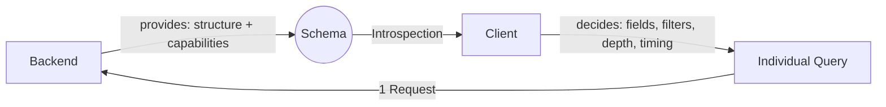
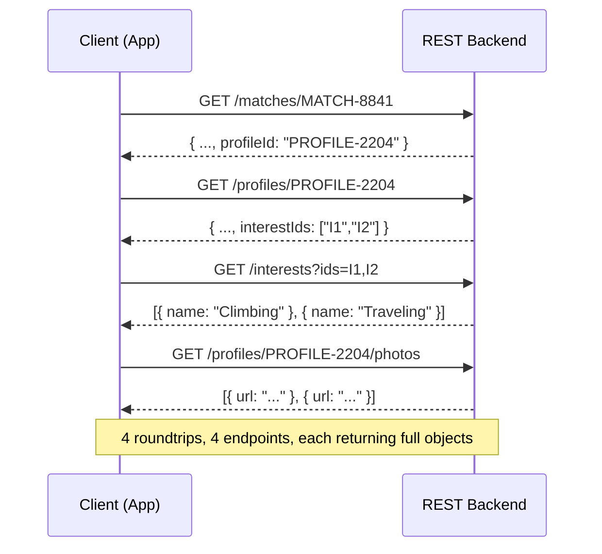
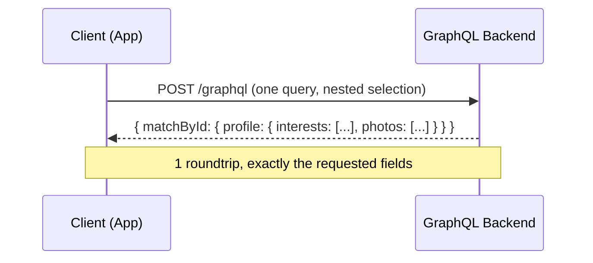
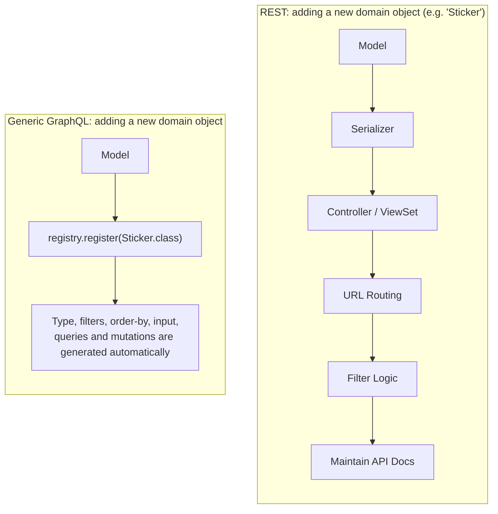

*[Deutsche Version](README.de.md)*

---

# Why a Generic GraphQL Schema? – The View from the Client's Side

*Example domain: a dating app (profiles, matches, interests, chats) – used
to illustrate the principle for a dating-app dev team.*

## Core Idea

> The backend builds a **data structure + a catalog of capabilities**
> exactly once. From then on, the **client** decides which data it
> combines, filters, sorts, and queries historically – without ever
> requiring new backend code to be written.



The backend turns from an "endpoint provider" into a **data source with
capabilities**. The business decision – *which* data, in *which*
combination, for *which* screen/feature – moves to where it actually
originates: the client (app team, web team, data science team, ...).

---

## The Same Use Case: REST vs. Generic GraphQL

 &nbsp;<span style="font-size: 1.8em; font-weight: bold; vertical-align: middle;">vs.</span>&nbsp; 

Use case: "Show me, for a match, the other user's profile, their
interests, and their photos."

### REST (classic) – one call per relationship



Every new relation in the chain means another roundtrip. Each endpoint
also returns its full, fixed response object – including fields the
client doesn't even need for this screen (e.g. internal scoring values in
the match object that only the recommendation algorithm uses).

### Generic GraphQL – one request, client decides depth and fields



```graphql
query {
  matchById(id: "MATCH-8841") {
    matchedAt
    profile {
      displayName
      bio
      interests { name }
      photos { url }
    }
  }
}
```

This single request is enough for the "match card" screen in the app.
For the detail screen, the same client simply requests more fields (e.g.
`lastActiveAt`, `verifiedAt`) – without any backend change. Internally the
backend batches this relation resolution via a dataloader (no N+1
problem) – invisible to the client, which only sees: one request, one
tailored response.

---

## Comparison Table

| Dimension | REST (classic) | Generic GraphQL |
|---|---|---|
| Endpoints | 1 endpoint per resource, often plus special parameters (`?include=`, `?expand=`) | 1 endpoint for all domain objects (profiles, matches, interests, messages, ...) |
| Field selection | Fixed per serializer → over-/under-fetching common (e.g. swipe card also loads the full profile) | Client selects fields per query, exactly as needed per screen |
| Loading relations | Multiple roundtrips or manually maintained `include` logic | Nested to any depth, one request, dataloader-batched |
| Filtering/sorting | Implemented individually per endpoint, usually only basic filters (e.g. `?minAge=`) | Generic for every object: AND/OR/NOT, full-text search (e.g. bio/interests), filtering across relations |
| History / "state before change X" | Usually not available, or a special endpoint per object | Available automatically, e.g. for trust & safety reviews: "what did the profile look like before it was reported?" |
| Writing (create/update/delete) | Own routes/verbs per resource, behavior varies (profile update ≠ match creation ≠ sending a message) | One unified mutation pattern for all objects |
| Type information | Separate OpenAPI/Swagger document, must be kept up to date manually | Introspection – schema is always current, codegen directly possible (e.g. typed Swift/Kotlin/TS clients) |
| New client requirement | Usually a new endpoint/parameter → needs a backend sprint (e.g. "show me shared interests in the match") | Usually already expressible via a different query structure, no deploy needed |
| Effort per new domain object | Model, serializer, controller, routing, filters, docs | Register the model – everything else is generated automatically |



---

## What the Client Concretely Gains

**1. Exactly the data it needs – no more, no less.**
The swipe card only loads `displayName`, `age`, `photos` – not the entire
profile including verification status, reports, or internal matching
scores. The profile detail screen, on the other hand, requests more
fields in the same query.

**2. Arbitrary navigation depth in a single request** (see comparison
above) – the client decides the depth, not the backend. A chat screen
can, for instance, load `conversation → messages →
sender.profile.photo` in one query.

**3. Filter, sort, and full-text search on its own – without consulting
the backend team.**
"Show me matches with the shared interest 'climbing' within a 20 km
radius, sorted by `lastActiveAt`" – a filter combination that nobody
explicitly anticipated when building the Interest or Match object is
still immediately usable.

**4. History for free.**
For trust & safety or support: "What did the profile look like before it
was reported?" or "When was verification revoked?" are ordinary queries,
not a special request to the backend.

**5. Unified, predictable write behavior.**
Whether it's a profile update, a new match, a sent message, or a report –
all follow the same mutation pattern. A client team learns the behavior
once and applies it to every domain object.

**6. Always up-to-date type information.**
Introspection exposes the entire schema to tooling – codegen for
iOS/Android/web clients, autocompletion, type checking – automatically
current, with no maintained API document going stale between app
releases.

**7. New requirements don't stall progress.**
The growth team wants to show "shared interests directly in the match
object" tomorrow? If Interest is already modeled as a relation, that's
just a new query – no sprint needed for a new backend feature.

---

## What the Backend Team Gets Out of It (in short)

- Adding a new domain object = **one registration**, not model +
  serializer + controller + routing + filters + docs
- No growing list of special-case endpoints that each need to be
  maintained individually (no `GET /matches/:id/common-interests` as a
  one-off)
- A fix/feature in the filter engine takes effect immediately for **all**
  domain objects
- A central place for authorization checks instead of scattered checks
  per endpoint (e.g. "edit your own profile" vs. "read-only for others'
  profiles")

---

## Staying Honest: The Price of This Freedom

- **Guardrails instead of control**: The backend gives up control over
  *what* is queried, and must instead centrally enforce *how much*
  (limits, nesting depth, query complexity, rate limiting) – otherwise an
  "overly free" client or a malicious request can build expensive/deep
  queries (relevant for a dating app: e.g. preventing mass scraping of
  other users' profiles).
- **Object-based authorization remains mandatory**: "Only your own
  messages/matches are visible" must be enforced centrally at the data
  layer, not optionally per field.
- **Less use-case documentation**: There is no endpoint that documents a
  concrete use case – the schema describes capabilities, not intentions.
  The client must know on its own which query it needs.

These points are solvable (query complexity limits, object-based access
checks per resolver, persisted queries/allowlisting for public clients) –
but they must be considered from the start, not bolted on afterward.

---

## Takeaway

**The backend provides the map, the client chooses the route.**
Build the data structure + capabilities once – after that, every client
team (app, web, support tooling, data) decides what it needs, when, and
in which combination.
